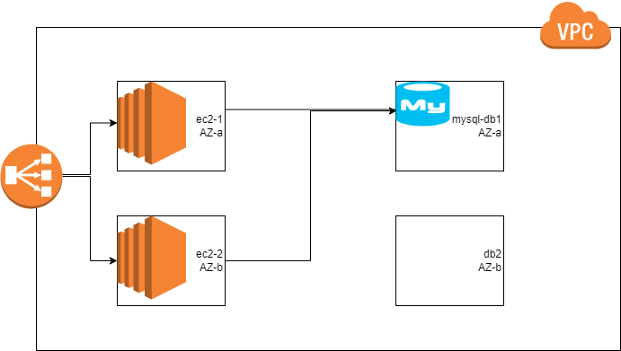

Terraform Workshop
-------------------

Problem Statement
-----------------

* We need to create an infra provisioning for an ecommerce app on virtual machine/ec2 instances
* AWS specific infra

* From jenkins/AzureDevOps we will be calling the infra provisioning to create
    * QA (System Test)
    * UAT (User Acceptance Test)

### Activities
* Create the network
* Create the database
* Optional: Create a vmimage/ami (manually)
* Create the vm/ec2 instance in subnet
* Execute provisioning
    * terraform => provisioner
    * arm templates/bicep => extension or user data
    * cloudformation => user data

