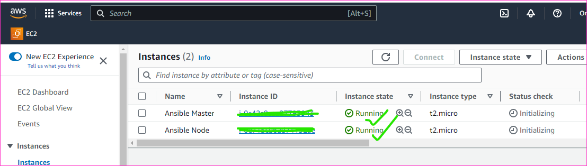

# aarkaymain
This is for  Practice purpose

Configure Management (CM)
--------------------------

* To connect Ansible-master with Ansible-node
* First of all Create two ec2 instances to configure our ansible

